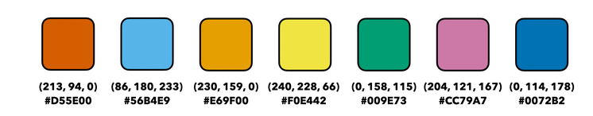

Additional Colors
=================
ATLAS MPL Style adds a number of additional color definitions to Matplotlib.

Default / ATLAS Color Cycle
---------------------------
These are the colors of the default (``ATLAS``) color cycle (Okabe & Ito).
This is the default color cycle when 7 or fewer colors are requested in ``set_color_cycle``, or when no number is given.
Note that for :math:`n > 7`, the ATLAS color cycle is Petroff (``petroff8`` if 8 colors are requested, or ``petroff10`` if more than 8).

+---------------------------------------------+-----------+-----------------------------------------------+
|``atlas:red`` (or ``atlas:vermilion``)       |``#D55E00``|.. image:: _colors/atlas:red.png               |
+---------------------------------------------+-----------+-----------------------------------------------+
|``atlas:lightBlue`` (or ``atlas:skyblue``)   |``#56B4E9``|.. image:: _colors/atlas:lightBlue.png         |
+---------------------------------------------+-----------+-----------------------------------------------+
|``atlas:orange``                             |``#E69F00``|.. image:: _colors/atlas:orange.png            |
+---------------------------------------------+-----------+-----------------------------------------------+
|``atlas:yellow``                             |``#F0E442``|.. image:: _colors/atlas:yellow.png            |
+---------------------------------------------+-----------+-----------------------------------------------+
|``atlas:green`` (or ``atlas:bluishGreen``)   |``#009E73``|.. image:: _colors/atlas:green.png             |
+---------------------------------------------+-----------+-----------------------------------------------+
|``atlas:purple`` (or ``atlas:reddishPurple``)|``#CC79A7``|.. image:: _colors/atlas:purple.png            |
+---------------------------------------------+-----------+-----------------------------------------------+
|``atlas:blue``                               |``#0072B2``|.. image:: _colors/atlas:blue.png              |
+---------------------------------------------+-----------+-----------------------------------------------+

Petroff Colors
--------------
These are the colors of the ``petroff10`` color cycle.
See *Accessible Color Sequences for Data Visualization* by Matthew A. Petroff (`arXiv:2107.02270 <https://arxiv.org/abs/2107.02270>`_).
When more than 7 colors are requested in the ATLAS color cycle (or when ``set_color_cycle(pal="Petroff", n=...)`` is explicitly called), the ``petroff8`` or ``petroff6`` / ``petroff10`` color cycle will be used.

+---------------------+-----------+-----------------------------------------------+
|``petroff:blue``     |``#3f90da``|.. image:: _colors/petroff:blue.png            |
+---------------------+-----------+-----------------------------------------------+
|``petroff:orange``   |``#ffa90d``|.. image:: _colors/petroff:orange.png          |
+---------------------+-----------+-----------------------------------------------+
|``petroff:red``      |``#bc1e00``|.. image:: _colors/petroff:red.png             |
+---------------------+-----------+-----------------------------------------------+
|``petroff:gray``     |``#94a4a2``|.. image:: _colors/petroff:gray.png            |
+---------------------+-----------+-----------------------------------------------+
|``petroff:purple``   |``#832db5``|.. image:: _colors/petroff:purple.png          |
+---------------------+-----------+-----------------------------------------------+
|``petroff:brown``    |``#a96b59``|.. image:: _colors/petroff:brown.png           |
+---------------------+-----------+-----------------------------------------------+
|``petroff:orange2``  |``#e76300``|.. image:: _colors/petroff:orange2.png         |
+---------------------+-----------+-----------------------------------------------+
|``petroff:tan``      |``#b8ab6f``|.. image:: _colors/petroff:tan.png             |
+---------------------+-----------+-----------------------------------------------+
|``petroff:gray2``    |``#707480``|.. image:: _colors/petroff:gray2.png           |
+---------------------+-----------+-----------------------------------------------+
|``petroff:lightBlue``|``#92dadd``|.. image:: _colors/petroff:lightBlue.png       |
+---------------------+-----------+-----------------------------------------------+

Paper Colors
------------
These colors are from the `Paper <https://github.com/NLKNguyen/papercolor-theme>`_ color scheme for VIM.

+-------------------------+-------------------------+-------------------------------------------+
|``paper:bg``             |``#eeeeee``              |.. image:: _colors/paper:bg.png            |
+-------------------------+-------------------------+-------------------------------------------+
|``paper:fg``             |``#444444``              |.. image:: _colors/paper:fg.png            |
+-------------------------+-------------------------+-------------------------------------------+
|``paper:bgAlt``          |``#e4e4e4``              |.. image:: _colors/paper:bgAlt.png         |
+-------------------------+-------------------------+-------------------------------------------+
|``paper:red``            |``#af0000``              |.. image:: _colors/paper:red.png           |
+-------------------------+-------------------------+-------------------------------------------+
|``paper:green``          |``#008700``              |.. image:: _colors/paper:green.png         |
+-------------------------+-------------------------+-------------------------------------------+
|``paper:blue``           |``#005f87``              |.. image:: _colors/paper:blue.png          |
+-------------------------+-------------------------+-------------------------------------------+
|``paper:yellow``         |``#afaf00``              |.. image:: _colors/paper:yellow.png        |
+-------------------------+-------------------------+-------------------------------------------+
|``paper:orange``         |``#d75f00``              |.. image:: _colors/paper:orange.png        |
+-------------------------+-------------------------+-------------------------------------------+
|``paper:pink``           |``#d70087``              |.. image:: _colors/paper:pink.png          |
+-------------------------+-------------------------+-------------------------------------------+
|``paper:purple``         |``#8700af``              |.. image:: _colors/paper:purple.png        |
+-------------------------+-------------------------+-------------------------------------------+
|``paper:lightBlue``      |``#0087af``              |.. image:: _colors/paper:lightBlue.png     |
+-------------------------+-------------------------+-------------------------------------------+
|``paper:olive``          |``#5f7800``              |.. image:: _colors/paper:olive.png         |
+-------------------------+-------------------------+-------------------------------------------+

Oceanic Next Colors
-------------------
These colors are from the `Oceanic Next
<https://github.com/voronianski/oceanic-next-color-scheme>`_ color scheme.

+-------------------------+-------------------------+-------------------------------------------+
|``on:bg``                |``#1b2b34``              |.. image:: _colors/on:bg.png               |
+-------------------------+-------------------------+-------------------------------------------+
|``on:fg``                |``#cdd3de``              |.. image:: _colors/on:fg.png               |
+-------------------------+-------------------------+-------------------------------------------+
|``on:bgAlt``             |``#343d46``              |.. image:: _colors/on:bgAlt.png            |
+-------------------------+-------------------------+-------------------------------------------+
|``on:fgAlt``             |``#d8dee9``              |.. image:: _colors/on:fgAlt.png            |
+-------------------------+-------------------------+-------------------------------------------+
|``on:red``               |``#ec5f67``              |.. image:: _colors/on:red.png              |
+-------------------------+-------------------------+-------------------------------------------+
|``on:orange``            |``#f99157``              |.. image:: _colors/on:orange.png           |
+-------------------------+-------------------------+-------------------------------------------+
|``on:yellow``            |``#fac863``              |.. image:: _colors/on:yellow.png           |
+-------------------------+-------------------------+-------------------------------------------+
|``on:green``             |``#99c794``              |.. image:: _colors/on:green.png            |
+-------------------------+-------------------------+-------------------------------------------+
|``on:cyan``              |``#5fb3b3``              |.. image:: _colors/on:cyan.png             |
+-------------------------+-------------------------+-------------------------------------------+
|``on:blue``              |``#6699cc``              |.. image:: _colors/on:blue.png             |
+-------------------------+-------------------------+-------------------------------------------+
|``on:pink``              |``#c594c5``              |.. image:: _colors/on:pink.png             |
+-------------------------+-------------------------+-------------------------------------------+
|``on:brown``             |``#ab7967``              |.. image:: _colors/on:brown.png            |
+-------------------------+-------------------------+-------------------------------------------+

HDBS Colors
-----------
These are the ATLAS HDBS physics groups colors. Mint cream is not included in the color cycle.

+-------------------------+-----------+-----------------------------------------------+
|``hdbs:starcommandblue`` |``#047cbc``|.. image:: _colors/hdbs:starcommandblue.png    |
+-------------------------+-----------+-----------------------------------------------+
|``hdbs:spacecadet``      |``#283044``|.. image:: _colors/hdbs:spacecadet.png         |
+-------------------------+-----------+-----------------------------------------------+
|``hdbs:maroonX11``       |``#b8336a``|.. image:: _colors/hdbs:maroonX11.png          |
+-------------------------+-----------+-----------------------------------------------+
|``hdbs:outrageousorange``|``#fa7e61``| .. image:: _colors/hdbs:outrageousorange.png  |
+-------------------------+-----------+-----------------------------------------------+
|``hdbs:pictorialcarmine``|``#ca1551``| .. image:: _colors/hdbs:pictorialcarmine.png  |
+-------------------------+-----------+-----------------------------------------------+
|``hdbs:mintcream``       |``#ebf5ee``| .. image:: _colors/hdbs:mintcream.png         |
+-------------------------+-----------+-----------------------------------------------+

HH Colors
---------
These are the ATLAS di-Higgs colors. Light turquoise and off-white are not included
in the automatic color cycle.

+---------------------+-----------+---------------------------------------------------+
|``hh:darkblue``      |``#343844``|.. image:: _colors/hh:darkblue.png                 |
+---------------------+-----------+---------------------------------------------------+
|``hh:darkpink``      |``#f2385a``|.. image:: _colors/hh:darkpink.png                 |
+---------------------+-----------+---------------------------------------------------+
|``hh:darkyellow``    |``#fdc536``|.. image:: _colors/hh:darkyellow.png               |
+---------------------+-----------+---------------------------------------------------+
|``hh:medturquoise``  |``#36b1bf``|.. image:: _colors/hh:medturquoise.png             |
+---------------------+-----------+---------------------------------------------------+
|``hh:lightturquoise``|``#4ad9d9``|.. image:: _colors/hh:lightturquoise.png           |
+---------------------+-----------+---------------------------------------------------+
|``hh:offwhite``      |``#e9f1df``|.. image:: _colors/hh:offwhite.png                 |
+---------------------+-----------+---------------------------------------------------+

ATLAS Limit Plot Colors
-----------------------
Also included are ``atlas:onesigma`` and ``atlas:twosigma``, which are the green and yellow used for the uncertainty bands in exclusion limit plots (the "Brazil band").

+-------------------------+-------------------------+---------------------------------------+
|``atlas:onesigma``       |``#00ff26``              |.. image:: _colors/atlas:onesigma.png  |
+-------------------------+-------------------------+---------------------------------------+
|``atlas:twosigma``       |``#fbff1f``              |.. image:: _colors/atlas:twosigma.png  |
+-------------------------+-------------------------+---------------------------------------+

Transparent
-----------
A fully transparent color is also provided for convenience.

+-------------------------+-------------------------+--------------------------------------+
|``transparent``          |``#ffffff00``            |.. image:: _colors/transparent.png    |
+-------------------------+-------------------------+--------------------------------------+
