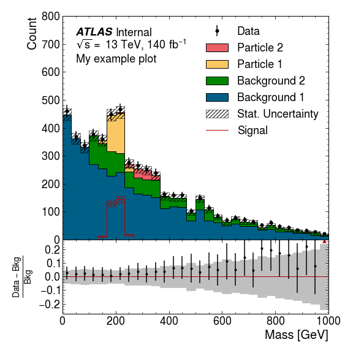

Example
=======

This example will show you how to make a plot with data, a number of
stacked MC components, a representative signal, and a ratio plot.

First, we just load some packages.

.. code:: python

    import numpy as np
    import matplotlib.pyplot as plt
    import scipy.stats.distributions as dist
    import boost_histogram as bh

Make Histograms
--------------------

We need some histograms to plot, so let’s generate some. We’re making
Boost histograms here but you can also read a TH1 from a ROOT file with
Uproot and convert it. We can deal with anything that follows the UHI
PlottableHistogram protocol.

.. code:: python

    rng = np.random.default_rng()
    bkg1_dist = dist.expon(0, 3)
    bkg2_dist = dist.expon(1, 3)
    part1_dist = dist.norm(2, 0.2)
    part2_dist = dist.norm(3, 0.4)
    
    bkg1_data = 100*bkg1_dist.rvs(4000, rng)
    bkg2_data = 100*bkg2_dist.rvs(1000, rng)
    part1_data = 100*part1_dist.rvs(300, rng)
    part2_data = 100*part2_dist.rvs(100, rng)
    noise_data = 100*rng.uniform(0, 10, 200)
    
    x_axis = bh.axis.Regular(30, 0, 1000)
    bkg1_h = bh.Histogram(x_axis).fill(bkg1_data)
    bkg2_h = bh.Histogram(x_axis).fill(bkg2_data)
    part1_h = bh.Histogram(x_axis).fill(part1_data)
    part2_h = bh.Histogram(x_axis).fill(part2_data)
    error_h = bh.Histogram(x_axis).fill(part2_data)
    data_h = bh.Histogram(x_axis).fill(bkg1_data).fill(bkg2_data).fill(part1_data).fill(part2_data).fill(noise_data)

Make Plot
-------------

We start by loading ATLAS MPL Style, and activating the configuration.

.. code:: python

    import atlas_mpl_style as ampl
    ampl.use_atlas_style()

First we setup the axes. ``ratio_axes()`` splits the figure into a large
main area, and a smaller area below for the ratio plot. The two will
have no space between them vertically, and share the x-axis.

.. code:: python

    fig, ax, rax = ampl.ratio_axes()
    ax.set_xlim(0, 1000)
    ax.set_ylim(0, 800);

First we plot the MC histograms. There’s a slight misnomer here, and all
the stacked histograms are called “Backgrounds”, but they need not
necessarily be backgrounds.

The return value is used to make the ratio plot. Note that unlike the
other plotting functions this one is only in ``ampl.plot``. Nevertheless
it can still take UHI histograms.

.. code:: python

    bkg = ampl.plot.plot_backgrounds([
        ampl.plot.Background(label="Background 1", hist=bkg1_h, color="paper:blue"),
        ampl.plot.Background(label="Background 2", hist=bkg2_h, color="paper:green"),
        ampl.plot.Background(label="Particle 1", hist=part1_h, color="on:yellow"),
        ampl.plot.Background(label="Particle 2", hist=part2_h, color="on:red"),
    ], ax=ax)

Next we plot the data, and a “signal”. This ``plot_signal`` function is
used to plot a representative signal that is layered on top of the other
histograms (rather than being stacked), and is drawn unfilled. You might
want to boost the strength of this signal to ensure it is visible.

If you are plotting a signal component whose strength relative to the
other MC components is accurate (e.g. the signal component of a fit) you
should include that in the stack of “Background”s.

.. code:: python

    ampl.uhi.plot_data(hist=data_h, ax=ax)
    ampl.uhi.plot_signal(label="Signal", hist=part1_h, color="paper:red")
    ampl.uhi.plot_ratio(data_h, bkg, ratio_ax=rax, plottype='diff')

Now we set the x and y labels. Note that the ``set_xlabel`` function can
be given the main axes, and the label will still be drawn below the
ratio axes.

.. code:: python

    ampl.set_xlabel("Mass [GeV]", ax=ax)
    ampl.set_ylabel("Count", ax=ax)
    
    # This one uses the axis set_ylabel because we want it centre aligned
    rax.set_ylabel(r"$\frac{{Data} - {Bkg}}{{Bkg}}$");

Finally we draw the ATLAS label and the legend. So long as the
components of the plot have been drawn using the ATLAS MPL style
functions the order of items in the legend will be determined
automatically if you use the ``ampl.draw_legend`` function.

.. code:: python

    ampl.draw_atlas_label(0.05, 0.95, ax=ax, status='int', simulation=False, energy='13 TeV', lumi=140, desc="My example plot")
    ampl.draw_legend(ax=ax); # Using one column here. If you have space, you can use ncols=2 for two columns

And save the figure, ensuring everything is visible.

.. code:: python

    fig.tight_layout()
    plt.savefig('test.png')

Output
------

