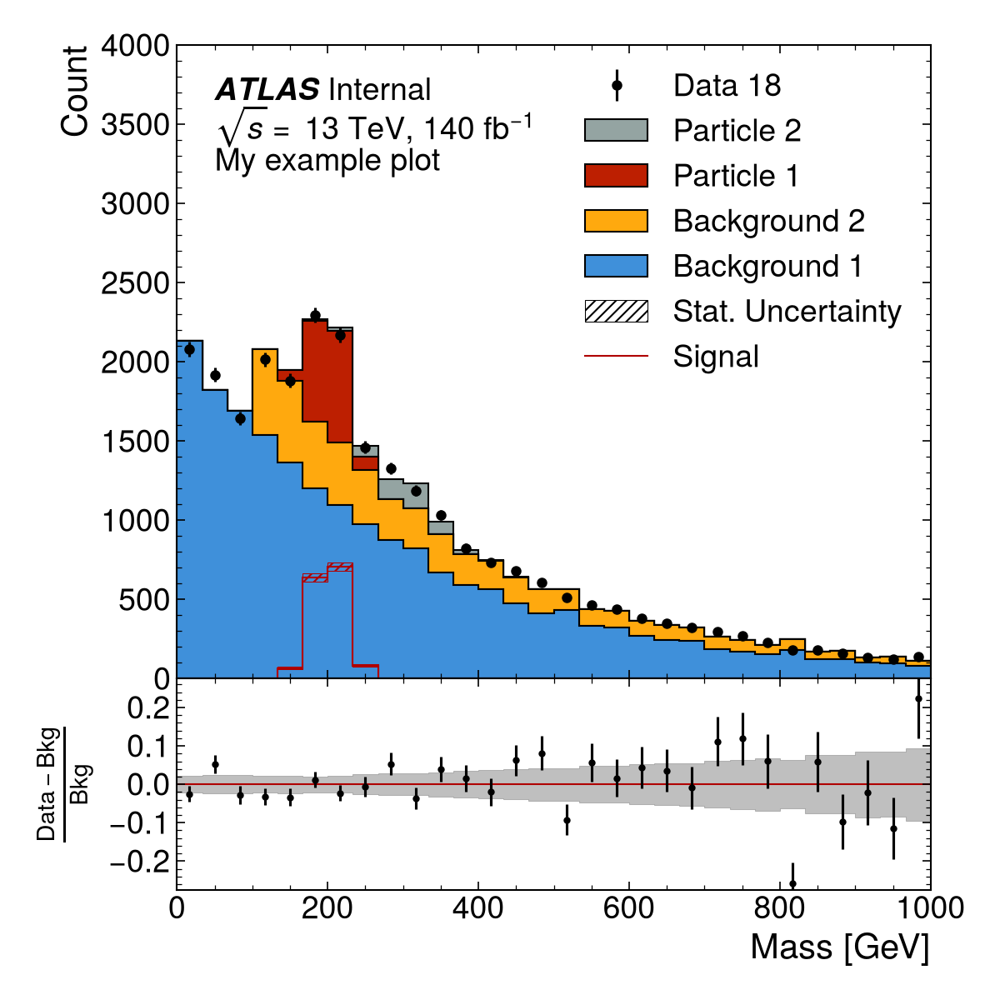
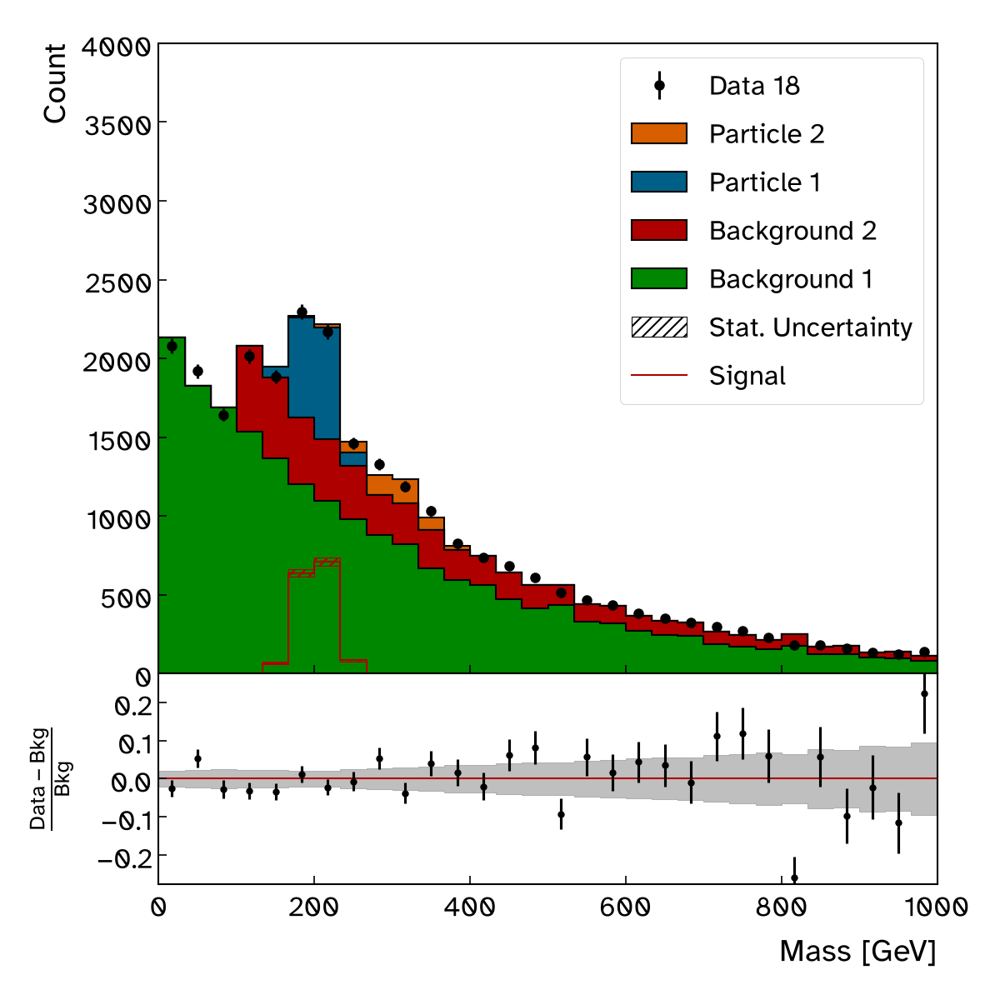

ATLAS Style
===========

The main purpose of this package is to provide a Matplotlib style closely
resembling that used by the `ATLAS <https://atlas.cern/>`_ experiment for
its plots.

This style can be activated by calling::

  import atlas_mpl_style as ampl
  ampl.use_atlas_style()

When the ATLAS style is active, text is typeset using LaTeX, and the
standard ATLAS label can be drawn using the ``ampl.draw_atlas_label``
function. The use of LaTeX can be disabled by instead calling ``ampl.use_atlas_style(usetex=False)``.

The axis labels should be set using the ``ampl.set_xlabel`` and
``ampl.set_ylabel`` functions to ensure they are correctly
right- or top-aligned.

Print Style
===========

A ``print`` style is also provided for quick non-ATLAS plots (e.g., for personal notes). This does not use TeX for typesetting and can be activated using::

  import matplotlib.pyplot as plt
  import atlas_mpl_style as ampl

  plt.style.use('print')

Color Cycles
============

By default, the ``ATLAS`` color cycle (based on Okabe & Ito) is used for :math:`n \le 7`.
When more than 7 colors are requested, it falls back to the accessible Petroff color sequences (``petroff8`` or ``petroff10``).

You can switch or customize the active color cycle at any time using ``ampl.set_color_cycle``::

  # Switch to Petroff palette with 6 colors
  ampl.set_color_cycle(pal='Petroff', n=6)

  # Reset to default ATLAS color cycle
  ampl.set_color_cycle()

See :doc:`colors` for full details and swatches of available palettes.

